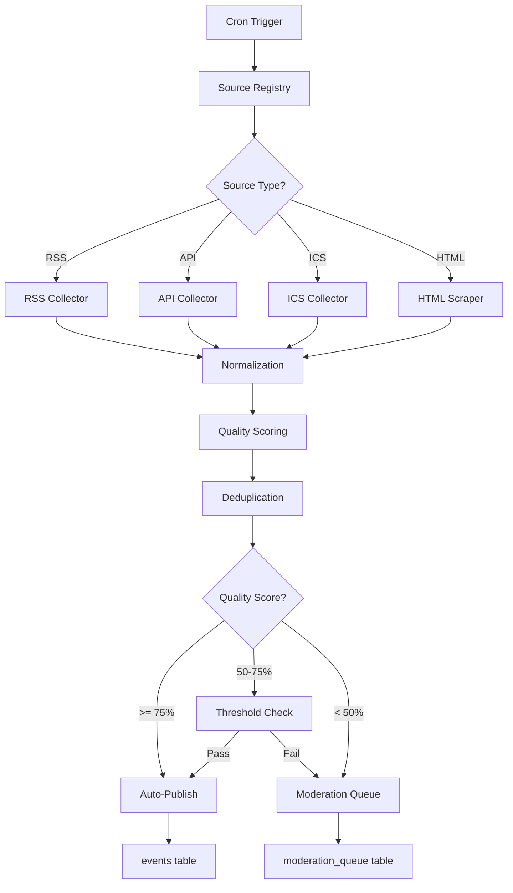

## Overview

TechCal's ingestion pipeline automatically collects events from multiple sources, applies quality scoring, deduplicates entries, and routes low-quality events to a moderation queue.

<Info>
  **Cron Schedule**: Hourly via Vercel cron (configured in `vercel.json`)
  
  **Manual Trigger**: `POST /api/admin/ingestion/run` (requires admin auth)
</Info>

## Architecture



## Source Types

### RSS Feeds

**Collector**: `src/services/ingestion/collectors/RssCollector.ts`

**Supported Formats**:

- RSS 2.0
- Atom
- Custom namespaces (Dublin Core, Media RSS)

**Example Source**:

```json
{
  "id": "uuid",
  "name": "TechCrunch Events",
  "url": "https://techcrunch.com/events/feed/",
  "source_type": "rss",
  "enabled": true,
  "ingestion_config": {
    "transform": "techcrunch",
    "quality_threshold": 70
  }
}
```

**Parsing**:

```typescript
import Parser from 'rss-parser';

const parser = new Parser({
  customFields: {
    item: [
      ['ev:location', 'location'],
      ['ev:startdate', 'startDate'],
      ['content:encoded', 'contentEncoded']
    ]
  }
});

const feed = await parser.parseURL(source.url);
const events = feed.items.map(item => normalizeRssItem(item));
```

### API Sources

**Collector**: `src/services/ingestion/collectors/ApiCollector.ts`

**Authentication**:

```json ingestion_config
{
  "headers": {
    "Authorization": "Bearer ${API_KEY}",
    "Accept": "application/json"
  },
  "pagination": {
    "type": "offset", // or 'cursor', 'page'
    "param": "offset",
    "limit": 100
  }
}
```

**Request Pattern**:

```typescript
async function fetchFromApi(source: EventSource): Promise<RawEvent[]> {
  const headers = source.ingestion_config.headers || {};
  const events: RawEvent[] = [];
  let offset = 0;
  let hasMore = true;

  while (hasMore) {
    const response = await fetch(
      `${source.url}?offset=${offset}&limit=100`,
      { headers }
    );
    const data = await response.json();
    
    events.push(...data.results);
    hasMore = data.has_more;
    offset += 100;
    
    // Rate limiting
    await sleep(1000);
  }

  return events;
}
```

### ICS Calendar Feeds

**Collector**: `src/services/ingestion/collectors/IcsCollector.ts`

**Supported**:

- iCalendar (.ics) format
- Recurring events (RRULE)
- Multi-day events
- Timezone handling (VTIMEZONE)

**Parsing**:

```typescript
import ical from 'node-ical';

const events = await ical.async.fromURL(source.url);

for (const event of Object.values(events)) {
  if (event.type !== 'VEVENT') continue;
  
  const normalized = {
    title: event.summary,
    description: event.description,
    startTime: event.start.toISOString(),
    endTime: event.end?.toISOString(),
    location: event.location,
    timezone: event.start.tz,
    sourceUrl: event.url || source.url,
    // Handle recurrence
    rrule: event.rrule ? event.rrule.toString() : null
  };
  
  yield normalized;
}
```

<Accordion title="Recurring Events">
  When an ICS feed includes recurring events (RRULE), the collector expands them into individual instances up to 1 year in the future:
  
  ```typescript
  if (event.rrule) {
    const rule = rrulestr(event.rrule.toString());
    const instances = rule.between(
      new Date(),
      addYears(new Date(), 1)
    );
    
    for (const instanceDate of instances) {
      yield createInstance(event, instanceDate);
    }
  }
  ```
</Accordion>

### HTML Scrapers

**Collector**: `src/services/ingestion/collectors/HtmlCollector.ts`

**Strategy**:

1. Fetch HTML page
2. Parse with Mozilla Readability
3. Extract structured data (JSON-LD, microdata)
4. Fallback to heuristic extraction

**Example**:

```typescript
import { Readability } from '@mozilla/readability';
import { JSDOM } from 'jsdom';

const response = await fetch(url);
const html = await response.text();
const dom = new JSDOM(html);

// Try JSON-LD first
const jsonLd = dom.window.document.querySelector('script[type="application/ld+json"]');
if (jsonLd) {
  const data = JSON.parse(jsonLd.textContent);
  if (data['@type'] === 'Event') {
    return normalizeJsonLd(data);
  }
}

// Fallback to Readability
const reader = new Readability(dom.window.document);
const article = reader.parse();
return extractEventFromArticle(article);
```

## Normalization

All sources are normalized to a common schema:

```typescript src/types/ingestion.ts
interface NormalizedEvent {
  // Required fields
  title: string;
  description: string;
  startTime: string; // ISO 8601
  sourceUrl: string;
  sourceId: string; // Unique ID from source
  
  // Optional fields
  endTime?: string;
  location?: string;
  timezone?: string;
  livestreamUrl?: string;
  registrationUrl?: string;
  eventType?: string;
  tags?: string[];
  organizer?: string;
  priceRange?: string;
  capacity?: number;
  difficulty?: 'beginner' | 'intermediate' | 'advanced';
  speakers?: Array<{
    name: string;
    title?: string;
    company?: string;
    bio?: string;
  }>;
}
```

**Normalization Steps**:

1. **Clean HTML**: Strip unwanted tags, sanitize content
2. **Parse dates**: Convert to ISO 8601 UTC
3. **Extract location**: Detect virtual vs. in-person
4. **Infer event type**: Classify as conference, workshop, meetup, etc.
5. **Extract pricing**: Parse free/paid indicators

```typescript
function normalizeEvent(raw: RawEvent, source: EventSource): NormalizedEvent {
  return {
    title: sanitizeHtml(raw.title, { allowedTags: [] }),
    description: cleanDescription(raw.description),
    startTime: parseDate(raw.startDate, source.ingestion_config.timezone),
    endTime: raw.endDate ? parseDate(raw.endDate) : null,
    location: normalizeLocation(raw.location),
    sourceUrl: raw.url || source.url,
    sourceId: generateSourceId(raw, source),
    eventType: inferEventType(raw.title, raw.description),
    // ... more fields
  };
}
```

## Quality Scoring

**Scorer**: `src/services/ingestion/QualityScorer.ts`

**Factors** (0-100 scale):

<Accordion title="1. Completeness (40 points)">
  How complete is the event data?
  
  ```typescript
  let score = 0;
  if (event.title) score += 5;
  if (event.description?.length > 100) score += 10;
  if (event.startTime) score += 5;
  if (event.endTime) score += 3;
  if (event.location) score += 5;
  if (event.registrationUrl) score += 5;
  if (event.organizer) score += 3;
  if (event.speakers?.length > 0) score += 4;
  ```
</Accordion>

<Accordion title="2. Content Quality (30 points)">
  Is the content well-written and informative?
  
  ```typescript
  // Description length
  if (description.length > 500) score += 10;
  else if (description.length > 200) score += 5;
  
  // Readability
  const sentences = description.split(/[.!?]/).length;
  if (sentences >= 3) score += 5;
  
  // Links and formatting
  if (hasValidLinks(description)) score += 5;
  if (hasStructuredContent(description)) score += 5;
  
  // No spam indicators
  if (!hasSpamKeywords(description)) score += 5;
  ```
</Accordion>

<Accordion title="3. Metadata Quality (20 points)">
  Are additional fields well-populated?
  
  ```typescript
  if (event.tags?.length >= 3) score += 5;
  if (event.difficulty) score += 3;
  if (event.targetAudience) score += 4;
  if (event.prerequisites) score += 3;
  if (event.agenda?.length > 0) score += 5;
  ```
</Accordion>

<Accordion title="4. Freshness (10 points)">
  Is the event upcoming and timely?
  
  ```typescript
  const daysUntilEvent = differenceInDays(event.startTime, new Date());
  if (daysUntilEvent >= 7 && daysUntilEvent <= 90) score += 10;
  else if (daysUntilEvent > 0) score += 5;
  else score = 0; // Past events get 0
  ```
</Accordion>

**Example Scores**:

- **90-100**: Complete, well-written, upcoming event with speakers and agenda
- **75-89**: Good event with minor missing fields
- **50-74**: Acceptable but needs review (moderation queue)
- **< 50**: Incomplete or low-quality (requires manual review)

## Deduplication

**Deduplicator**: `src/services/ingestion/DeduplicationService.ts`

### Fuzzy Matching

**Strategy**: Multi-stage comparison

1. **Exact URL match**: Same `sourceUrl` = duplicate
2. **Title similarity**: Levenshtein distance < 10%
3. **Date + location match**: Same day + same venue
4. **Content similarity**: Cosine similarity of description embeddings

```typescript
function findSimilarEvents(
  candidate: NormalizedEvent,
  existingEvents: Event[]
): Event[] {
  const matches: Array<{ event: Event; similarity: number }> = [];

  for (const existing of existingEvents) {
    let similarity = 0;

    // URL exact match (100%)
    if (candidate.sourceUrl === existing.sourceUrl) {
      return [existing];
    }

    // Title similarity (40% weight)
    const titleSim = levenshteinSimilarity(candidate.title, existing.title);
    similarity += titleSim * 0.4;

    // Date proximity (30% weight)
    const hoursDiff = Math.abs(
      differenceInHours(candidate.startTime, existing.startTime)
    );
    const dateSim = Math.max(0, 1 - hoursDiff / 48); // Within 48 hours
    similarity += dateSim * 0.3;

    // Location similarity (30% weight)
    const locationSim = locationMatch(candidate.location, existing.location);
    similarity += locationSim * 0.3;

    if (similarity >= 0.85) {
      matches.push({ event: existing, similarity });
    }
  }

  return matches.sort((a, b) => b.similarity - a.similarity).map(m => m.event);
}
```

### Duplicate Resolution

**Policy**:

- If similarity >= 95%: Skip (exact duplicate)
- If similarity >= 85%: Merge metadata (keep richer version)
- If similarity < 85%: Treat as separate event

```typescript
if (similarity >= 0.95) {
  logger.info('Skipping exact duplicate', { candidateId, existingId });
  return { action: 'skip', existingEvent };
}

if (similarity >= 0.85) {
  logger.info('Merging duplicate with richer metadata', { candidateId, existingId });
  return {
    action: 'merge',
    mergedEvent: mergeEvents(candidate, existing)
  };
}

return { action: 'create' };
```

## Auto-Publish Thresholds

```typescript
const QUALITY_THRESHOLDS = {
  AUTO_PUBLISH: 75,  // >= 75% quality score
  MANUAL_REVIEW: 50, // 50-74% goes to moderation queue
  REJECT: 50,        // < 50% requires manual review
} as const;

function determineAction(qualityScore: number): 'publish' | 'moderate' | 'reject' {
  if (qualityScore >= QUALITY_THRESHOLDS.AUTO_PUBLISH) {
    return 'publish';
  }
  if (qualityScore >= QUALITY_THRESHOLDS.MANUAL_REVIEW) {
    return 'moderate';
  }
  return 'reject';
}
```

<Note>
  Thresholds can be customized per source in `ingestion_config.quality_threshold`.
</Note>

## Moderation Queue

**Admin Dashboard**: `/admin/ingestion/moderation`

**Features**:

- View pending events sorted by quality score
- See duplicate matches with similarity scores
- Bulk approve/reject actions
- Edit event details before publishing
- View ingestion history and error logs

**Queue Schema**:

```typescript
interface ModerationQueueEntry {
  id: string;
  event_id: string; // Temporary event in staging
  source_id: string;
  quality_score: number;
  deduplication_matches: Array<{
    event_id: string;
    similarity: number;
  }>;
  flagged_reasons: string[];
  created_at: string;
  reviewed_at?: string;
  reviewer_id?: string;
  decision?: 'approved' | 'rejected' | 'merged';
}
```

**Workflow**:

1. Moderator reviews event details
2. Checks for duplicates
3. Edits metadata if needed
4. Approves → Moves to `events` table
5. Rejects → Archives to `rejected_events`
6. Merges → Combines with existing event

## Race Condition Safety

**Problem**: Multiple cron instances running simultaneously

**Solution**: Distributed locking with Redis

```typescript
import { Redis } from '@upstash/redis';

const redis = Redis.fromEnv();
const LOCK_KEY = 'ingestion:lock';
const LOCK_TTL = 300; // 5 minutes

async function runIngestion() {
  // Try to acquire lock
  const acquired = await redis.set(LOCK_KEY, Date.now(), {
    nx: true, // Only set if not exists
    ex: LOCK_TTL
  });

  if (!acquired) {
    logger.warn('Another ingestion is running, skipping');
    return { status: 'skipped', reason: 'lock_held' };
  }

  try {
    // Run ingestion
    await ingestFromAllSources();
  } finally {
    // Release lock
    await redis.del(LOCK_KEY);
  }
}
```

## Error Handling

### Retry Strategy

**Exponential backoff** for transient failures:

```typescript
import pLimit from 'p-limit';

const limit = pLimit(3); // Max 3 concurrent requests

async function fetchWithRetry(
  url: string,
  maxRetries = 3
): Promise<Response> {
  let lastError: Error;
  
  for (let attempt = 0; attempt < maxRetries; attempt++) {
    try {
      return await fetch(url, { timeout: 10000 });
    } catch (error) {
      lastError = error;
      const delay = Math.min(1000 * 2 ** attempt, 10000);
      await sleep(delay);
    }
  }
  
  throw lastError;
}
```

### Error Logging

**Sentry Integration**:

```typescript
import * as Sentry from '@sentry/nextjs';

try {
  await ingestFromSource(source);
} catch (error) {
  Sentry.captureException(error, {
    tags: {
      source_id: source.id,
      source_type: source.source_type
    },
    extra: {
      source_url: source.url,
      last_success: source.last_ingested_at
    }
  });
  
  // Mark source as errored
  await markSourceErrored(source.id, error.message);
}
```

## Environment Variables

```bash
# Required
CRON_SECRET=...  # Vercel cron authentication
SUPABASE_SERVICE_ROLE_KEY=...  # Database write access

# Optional
INGESTION_VERIFY_SPEAKERS=true  # Verify speaker URLs exist (default: true)
INGESTION_BATCH_SIZE=100  # Events per batch (default: 100)
INGESTION_TIMEOUT=300000  # Max runtime in ms (default: 5 minutes)
```

## Performance

**Benchmarks**:

- **RSS feed (100 items)**: ~3 seconds
- **API source (500 events)**: ~15 seconds (with rate limiting)
- **ICS calendar (50 events)**: ~2 seconds
- **Full ingestion (10 sources)**: ~60 seconds

**Optimizations**:

1. **Parallel source processing**: Process multiple sources concurrently
2. **Batch inserts**: Insert 100 events at a time
3. **Cached deduplication**: Keep in-memory index of recent events
4. **Incremental ingestion**: Track `last_ingested_at` per source

## Monitoring

**Metrics Tracked**:

- Events ingested per source
- Quality score distribution
- Duplicate detection rate
- Moderation queue size
- Ingestion errors by source
- Processing time per source

**Dashboard**: PostHog/Sentry dashboards show:

- Ingestion success rate (target: > 95%)
- Average quality score (target: > 70)
- Moderation queue backlog (target: < 50 events)

## Manual Testing

```bash
# Test ingestion locally
npm run ingest

# Verify ingestion setup
npm run verify-ingestion

# Analyze ingestion data
npm run analyze-ingestion
```

<Warning>
  Always test ingestion against staging environment first. Production ingestion can insert hundreds of events.
</Warning>

## Next Steps

<CardGroup cols={2}>
  <Card title="Data Model" icon="database" href="/architecture/data-model">
    Understand the database schema for events
  </Card>
  <Card title="Recommendation System" icon="sparkles" href="/architecture/recommendation-system">
    See how ingested events are scored and ranked
  </Card>
</CardGroup>