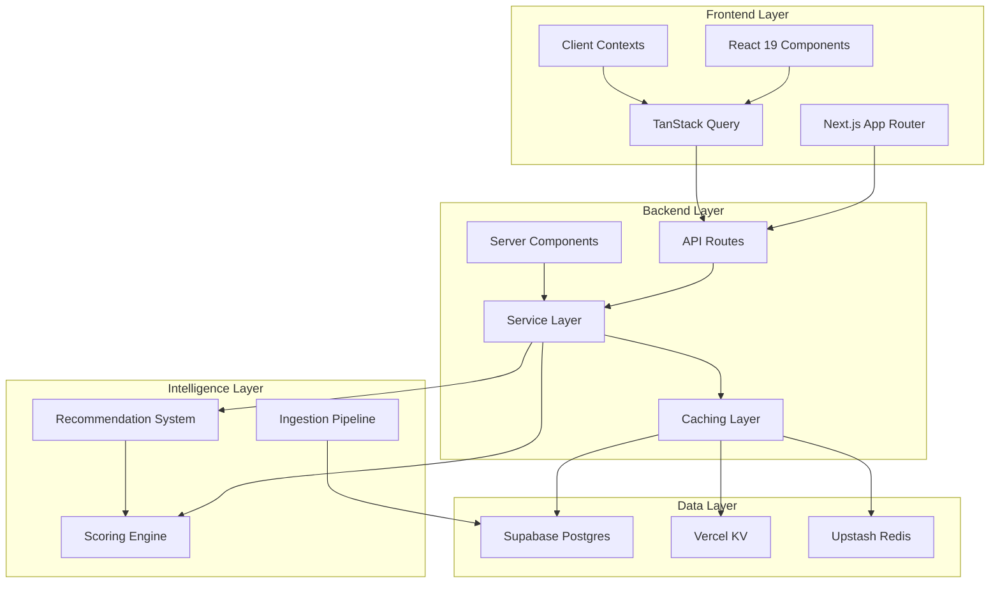

## Architecture Overview

TechCal is a modern career operating system built on a scalable, type-safe architecture that combines server-side rendering, real-time data access, and intelligent recommendation systems.

## System Layers

The platform follows a layered architecture with clear separation of concerns:



## Layer Breakdown

### Frontend Layer

**Next.js App Router** with device-aware routing and server-side rendering:

- **Public Routes**: Landing pages, marketing content, authentication
- **Protected Routes**: Dashboard, calendar, discovery workspace
- **Layout Guards**: Enforce onboarding completion at `src/app/(protected)/layout.tsx:73-82`

**React 19 Components** with modern concurrent features:

- Server components for initial data fetching
- Client components for rich interactivity
- Lazy-loaded UI libraries (MUI, FullCalendar)
- Framer Motion and GSAP for animations

**State Management**:

- **TanStack Query**: Client data fetching with hydration from server components
- **React Context**: Cross-cutting concerns (auth, calendar, notifications)
- **Local State**: Component-specific UI state

### Backend Layer

**API Routes** with authentication and rate limiting:

<CodeGroup>
```typescript src/app/api/events/filtered/route.ts
// Filtered events endpoint with unified server filtering
export async function GET(request: NextRequest) {
  const supabase = createClient();
  const { data: { user } } = await supabase.auth.getUser();
  
  // Rate limiting via Upstash
  const rateLimit = await checkRateLimit(request);
  if (!rateLimit.success) {
    return NextResponse.json({ error: 'Rate limit exceeded' }, { status: 429 });
  }
  
  // Server-side filtering and enrichment
  const events = await getFilteredEvents(params, user);
  return NextResponse.json(events);
}
```

```typescript src/app/api/events/recommendations/route.ts
// Recommendations endpoint with career impact scoring
export async function GET(request: NextRequest) {
  const profile = await getCareerProfile(userId);
  const events = await getUpcomingEvents();
  
  // Enrich with career impact scores
  const enriched = await enrichEventsWithCareerImpact(
    events,
    profile,
    supabase,
    userId
  );
  
  return NextResponse.json(enriched);
}
```
</CodeGroup>

**Service Layer** with strongly-typed data access (`src/services/`):

- Event services: CRUD, filtering, search
- Career services: Profile management, onboarding
- Analytics services: Telemetry, monitoring, insights
- Scoring services: Career impact calculation

**Caching Strategy**:

- **Redis (Vercel KV)**: Career impact scores (1 hour TTL)
- **Upstash**: Rate limit sliding windows
- **React Query**: Client-side query caching

### Data Access Layer

**Supabase** provides:

- **PostgreSQL**: Relational database with RLS policies
- **Auth**: User authentication and session management
- **Storage**: Avatar uploads and media files
- **Real-time**: Subscription to data changes

**Key Tables**:

- `events`: Core event data
- `profiles`: User profiles and career data
- `tracked_events`: User event interactions (bookmarks, attendance)
- `event_speakers`: Speaker information and relationships
- `hackathons`: Hackathon coordination and teams
- `follows`: Social network connections

### Intelligence Layer

**Scoring Engine** (`src/lib/recommendation/baseScorer.ts:252-554`):

- Pure alignment core for career-event matching
- Skill, goal, interest, and networking alignment
- Cold-start scoring for anonymous users

**Recommendation System**:

- Base scoring → Advanced scoring → Behavioral reranking
- Shadow mode for A/B testing
- Diversity enhancement to prevent filter bubbles

**Ingestion Pipeline**:

- Modular collectors (RSS, API, ICS, HTML)
- Quality scoring and auto-publish thresholds
- Deduplication with fuzzy matching
- Admin moderation queue

## Key Architectural Decisions

### Server-Side Rendering

<Note>
  Server components fetch data during SSR, reducing client bundle size and improving initial load performance.
</Note>

Authenticated layouts enforce onboarding completion:

```typescript src/app/(protected)/layout.tsx
export default async function ProtectedLayout({ children }) {
  const profile = await getServerProfile();
  
  if (!profile?.onboarding_completed) {
    redirect('/onboarding/career');
  }
  
  return <>{children}</>;
}
```

### Type Safety

Strict TypeScript throughout with Supabase-generated types:

```typescript src/types/database.ts
import { Database } from './supabase';

export type SupabaseClientType = SupabaseClient<Database>;
```

All database queries are fully typed with autocomplete and compile-time validation.

### Feature Flags

Environment-based feature toggles enable safe rollouts:

```bash
# Scoring strategy selection
DISCOVERY_SCORING=server|legacy|shadow

# Behavioral reranking
DISCOVERY_RERANK=off|advanced|shadow

# Feature toggles
NEXT_PUBLIC_ENABLE_BEHAVIORAL_BOOST=true
NEXT_PUBLIC_ENABLE_DIVERSITY_ENHANCEMENT=true
```

<Accordion title="Shadow Mode for Safe Experimentation">
  Shadow mode computes both legacy and new algorithms, logs deltas for analysis, but serves the stable version to users. This enables data-driven iteration without production risk.
  
  ```typescript
  if (strategy === 'shadow') {
    const legacyScores = await computeLegacy(events);
    const newScores = await computeNew(events);
    logDelta(legacyScores, newScores);
    return legacyScores; // Serve stable version
  }
  ```
</Accordion>

### Telemetry & Monitoring

**Sentry Integration**:

- Breadcrumbs for scoring decisions
- Exception tracking with context
- Performance monitoring

**Analytics Logging** (`src/utils/supabase/telemetry.ts`):

- Sanitized payload logging
- Asynchronous writes
- Sampled at 10% to reduce overhead

**Recommendation Monitoring**:

- CTR tracking by trigger and score bucket
- Score distribution analysis
- Behavioral boost effectiveness

## Entry Points

### Public Access

- `/` - Landing page with adaptive marketing
- `/u/[username]` - Public user profiles
- `/community` - Community directory

### Protected Access

- `/discover` - Discovery workspace with filtering and scoring
- `/calendar` - FullCalendar-powered event scheduling
- `/dashboard` - Career analytics and goal tracking
- `/hackathons` - Team coordination and participation

### Admin Access

- `/admin/ingestion/moderation` - Event moderation queue
- `/admin/ingestion/run` - Manual ingestion trigger

## Deployment

Vercel-compatible architecture:

- **Edge Functions**: Rate limiting, authentication checks
- **Serverless Functions**: API routes, server components
- **Static Generation**: Marketing pages, documentation
- **Cron Jobs**: Configured in `vercel.json` for hourly ingestion

<Warning>
  Service role keys must never be exposed to the client. Use `SUPABASE_SERVICE_ROLE_KEY` only in server-side contexts.
</Warning>

## Performance Budgets

The platform enforces performance budgets:

```bash
npm run test:budget
```

Validates:

- Scoring latency < 100ms per event
- API response times < 500ms
- Client bundle size < 500KB

## Next Steps

<CardGroup cols={2}>
  <Card title="Tech Stack" icon="layer-group" href="/architecture/tech-stack">
    Explore the complete technology stack and dependencies
  </Card>
  <Card title="Data Model" icon="database" href="/architecture/data-model">
    Learn about database schema and relationships
  </Card>
  <Card title="Scoring Engine" icon="calculator" href="/architecture/scoring-engine">
    Understand the career alignment scoring algorithm
  </Card>
  <Card title="Ingestion Pipeline" icon="download" href="/architecture/ingestion-pipeline">
    See how events are collected and processed
  </Card>
</CardGroup>