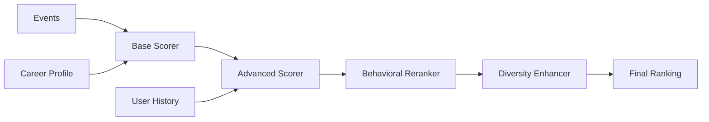

## Overview

TechCal's recommendation system layers multiple scoring strategies to deliver personalized event recommendations:

1. **Base Alignment Core**: Pure skill/goal/interest matching
2. **Advanced Scoring**: Career stage, timing, industry, and behavioral signals
3. **Behavioral Reranking**: User interaction history
4. **Diversity Enhancement**: Prevent filter bubbles



## Architecture

### Strategy Pattern

**Factory**: `src/services/scoring/strategies/ScoringStrategyFactory.ts`

```typescript
export class ScoringStrategyFactory {
  static getDefaultStrategy(): ScoringStrategy {
    return new AdvancedScorer();
  }
  
  static getStrategy(version: string): ScoringStrategy {
    switch (version) {
      case 'v2.0.0':
        return new AdvancedScorer();
      case 'v1.0.0':
        return new LegacyScorer();
      default:
        return new AdvancedScorer();
    }
  }
}
```

## Advanced Scoring Strategy

**Version**: `v2.0.0`

**Location**: `src/services/scoring/strategies/AdvancedScorer.ts`

### Component Weights

```typescript src/services/scoring/strategies/AdvancedScorer.ts:63
private readonly config = {
  weights: {
    skillRelevance: 0.30,    // 30%
    careerStageMatch: 0.25,  // 25%
    networkingValue: 0.20,   // 20%
    industryRelevance: 0.15, // 15%
    timingBonus: 0.10,       // 10%
  },
  // ...
};
```

### 1. Skill Relevance (30%)

**Sub-components**:

- **Event Type Score** (35%): Workshop = 90, Conference = 80, Meetup = 70, Webinar = 60
- **Skill Matching** (35%): Keyword analysis of skills to learn and primary skills
- **Content Depth** (10%): Description length, agenda items, prerequisites
- **Learning Format** (10%): Hands-on vs. lecture detection
- **Event Type Preference** (10%): User's preferred event types

**Type Preference Gate**:

```typescript src/services/scoring/strategies/AdvancedScorer.ts:261-285
const preferredTypes = careerProfile.preferredEventTypes || [];
const typePreferenceScore = calculateTypePreferenceScore(
  event.category?.name,
  preferredTypes
);

// Soft gate: reduce score if event type doesn't match preferences
const gateStrength = process.env.NEXT_PUBLIC_TYPE_PREF_GATE || 0.75;
const typePreferenceGate = 
  preferredTypes.length > 0 && typePreferenceScore <= 50 
    ? gateStrength 
    : 1.0;

if (typePreferenceGate < 1) {
  scoringTriggers.push('type_pref_gate');
  appliedAdjustments.typePreferenceGate = typePreferenceGate;
}

// Apply gate to skill relevance components
score += eventTypeResult.weightedScore * typePreferenceGate;
```

<Accordion title="Beginner Boost">
  Beginner-friendly events get bonus points:
  
  ```typescript
  if (event.difficulty === 'beginner') {
    score += 15;
    scoringTriggers.push('beginner_boost');
    appliedAdjustments.beginnerBoost = 15;
  }
  
  // Keyword detection
  const beginnerKeywords = ['beginner', '101', 'intro', 'getting started'];
  if (beginnerKeywords.some(kw => eventText.includes(kw))) {
    score += 10;
  }
  ```
</Accordion>

### 2. Career Stage Match (25%)

**Sub-components**:

- **Seniority Matching** (50%): Junior → learning events, Senior → leadership events
- **Career Goals Alignment** (30%): Keyword matching against goal taxonomy
- **Learning Style Match** (20%): Hands-on vs. theoretical preference

**Seniority Scoring**:

```typescript src/lib/scoring/careerStageScoringUtils.ts
export function calculateSeniorityMatch(
  event: Event,
  careerProfile: CareerProfile
): number {
  const seniority = careerProfile.seniority;
  const eventText = `${event.title} ${event.description}`.toLowerCase();

  let score = 50; // Baseline

  const seniorityKeywords = {
    'entry-level': ['beginner', 'intro', '101', 'fundamentals', 'basics'],
    'junior': ['intermediate', 'practical', 'hands-on', 'workshop'],
    'mid-level': ['advanced', 'deep dive', 'architecture', 'best practices'],
    'senior': ['expert', 'leadership', 'strategy', 'scaling', 'optimization'],
    'staff': ['architecture', 'systems', 'platform', 'principal', 'distinguished'],
    'principal': ['architecture', 'vision', 'strategy', 'thought leadership']
  };

  const keywords = seniorityKeywords[seniority] || [];
  const matchCount = keywords.filter(kw => eventText.includes(kw)).length;

  if (matchCount >= 3) score += 30;
  else if (matchCount >= 2) score += 20;
  else if (matchCount >= 1) score += 10;

  return Math.min(score, 100);
}
```

### 3. Networking Value (20%)

**Sub-components**:

- **Speaker Quality** (40%): C-level, industry experts, thought leaders
- **Networking Opportunities** (30%): Attendee count, networking sessions
- **Industry Alignment** (20%): Speakers from user's industry
- **Event Scale** (10%): Prestige indicators (major venue, large attendance)

**Speaker Quality Analysis**:

```typescript src/lib/scoring/networkingScoringUtils.ts
export function analyzeSpeakerQuality(
  event: Event,
  careerProfile: CareerProfile
): number {
  const speakers = event.speakerLineup || [];
  if (speakers.length === 0) return 50;

  let score = 50;

  // Senior title indicators
  const seniorTitles = ['cto', 'ceo', 'vp', 'director', 'head of', 'principal', 'distinguished'];
  const seniorCount = speakers.filter(s => 
    seniorTitles.some(title => s.title?.toLowerCase().includes(title))
  ).length;

  if (seniorCount >= 3) score += 30;
  else if (seniorCount >= 2) score += 20;
  else if (seniorCount >= 1) score += 10;

  // Company reputation
  const majorCompanies = ['google', 'microsoft', 'amazon', 'meta', 'apple', 'netflix'];
  const majorCompanyCount = speakers.filter(s =>
    majorCompanies.some(company => s.company?.toLowerCase().includes(company))
  ).length;

  if (majorCompanyCount >= 2) score += 20;
  else if (majorCompanyCount >= 1) score += 10;

  return Math.min(score, 100);
}
```

### 4. Industry Relevance (15%)

**Sub-components**:

- **Industry Alignment** (60%): User's industry keywords in event content
- **Sector Trends** (25%): Emerging technologies, innovation keywords
- **Market Relevance** (15%): Company size and event scale matching

```typescript src/services/scoring/strategies/AdvancedScorer.ts:623-692
private calculateIndustryAlignment(event: Event, careerProfile: CareerProfile): number {
  const industry = careerProfile.industry?.toLowerCase() || "";
  if (!industry) return 50;

  const eventText = `${event.title} ${event.description}`.toLowerCase();
  
  const industryMappings: Record<string, { keywords: string[], score: number }> = {
    "technology": {
      keywords: ["tech", "software", "digital", "innovation", "ai", "ml"],
      score: 85
    },
    "finance": {
      keywords: ["finance", "fintech", "banking", "trading", "crypto"],
      score: 80
    },
    // ... more industries
  };

  const mapping = industryMappings[industry];
  if (!mapping) return 50;

  let score = mapping.score;
  let matchCount = 0;

  for (const keyword of mapping.keywords) {
    if (eventText.includes(keyword)) {
      matchCount++;
      score += 5;
    }
  }

  return Math.min(score, 100);
}
```

### 5. Timing Bonus (10%)

**Sub-components**:

- **Career Timing** (50%): Alignment with career goals timeframe
- **Seasonal Timing** (30%): Q1/Q4 conference season bonus
- **Schedule Alignment** (20%): Event duration vs. available time

```typescript src/services/scoring/strategies/AdvancedScorer.ts:796-826
private analyzeCareerTiming(event: Event, careerProfile: CareerProfile): number {
  const seniority = careerProfile.seniority || "mid-level";
  const timeframe = careerProfile.timeframe || "medium-term";
  const goals = careerProfile.careerGoals || [];

  let score = 60;

  // Junior engineers benefit from immediate learning opportunities
  if (seniority === "junior") {
    const skillKeywords = ["learn", "training", "workshop", "fundamentals"];
    if (skillKeywords.some(kw => eventText.includes(kw))) {
      score += 25;
    }
  }

  // Senior engineers benefit from leadership and strategy content
  if (seniority === "senior") {
    const leadershipKeywords = ["leadership", "strategy", "management"];
    if (leadershipKeywords.some(kw => eventText.includes(kw))) {
      score += 25;
    }
  }

  return Math.min(score, 100);
}
```

## Behavioral Reranking

**Location**: `src/services/recommendations/behavioralReranker.ts`

### Strategy

Re-sort top K events using behavioral signals:

```typescript src/services/recommendations/behavioralReranker.ts:22-28
export async function rerankWithBehavioral(
  events: EventWithCareerImpact[],
  careerProfile: CareerProfile,
  supabaseClient: SupabaseClientType,
  options: RerankOptions = {}
): Promise<EventWithCareerImpact[]> {
  const topK = Math.max(1, Math.min(options.topK ?? 30, 200));
  // ...
}
```

**Process**:

1. Take top K events by base score (default: 30)
2. Fetch user's interaction history (last 30 events)
3. Compute advanced scores with behavioral boost
4. Re-sort by advanced score
5. Preserve original order for ties

### Behavioral Boost

**Service**: `src/services/behavioralBoostService.ts`

**Similarity Factors**:

- **Category similarity**: Same event type
- **Tag overlap**: Shared tags
- **Skill overlap**: Common skills
- **Speaker overlap**: Common speakers
- **Location similarity**: Same city or virtual

```typescript
export async function calculateBehavioralBoost(
  userId: string,
  targetEvent: Event,
  interactedEvents: Event[],
  supabase: SupabaseClientType
): Promise<{ boost: number; similarEvents: string[] }> {
  if (interactedEvents.length === 0) {
    return { boost: 0, similarEvents: [] };
  }

  const similarities = interactedEvents.map(interactedEvent => ({
    eventId: interactedEvent.id,
    score: calculateSimilarity(targetEvent, interactedEvent)
  }));

  // Sort by similarity and take top 5
  const topSimilar = similarities
    .sort((a, b) => b.score - a.score)
    .slice(0, 5);

  // Boost proportional to average similarity
  const avgSimilarity = topSimilar.reduce((sum, s) => sum + s.score, 0) / topSimilar.length;
  const boost = Math.min(avgSimilarity * 20, 15); // Cap at 15 points

  return {
    boost,
    similarEvents: topSimilar.map(s => s.eventId)
  };
}
```

<Info>
  Behavioral boost is capped at 15 points to prevent over-optimization for past behavior.
</Info>

## Diversity Enhancement

**Service**: `src/services/diversityEnhancementService.ts`

### Purpose

Prevent filter bubbles by ensuring variety across:

- Event types (conference, workshop, meetup)
- Categories (web dev, AI, product)
- Formats (virtual, in-person, hybrid)

### Algorithm

**Shannon Entropy** measures distribution diversity:

```typescript src/services/diversityEnhancementService.ts:168-196
private static calculateDistributionDiversity(
  distribution: Map<string, number>,
  total: number
): number {
  if (total === 0) return 0;
  if (distribution.size === 1) return 0; // No diversity

  // Calculate Shannon entropy
  let entropy = 0;
  for (const count of distribution.values()) {
    const probability = count / total;
    if (probability > 0) {
      entropy -= probability * Math.log2(probability);
    }
  }

  // Normalize by maximum possible entropy
  const maxEntropy = Math.log2(distribution.size);
  return maxEntropy > 0 ? entropy / maxEntropy : 0;
}
```

**Diversity Score** (0-1):

```typescript
const diversityScore = 
  (eventTypeDiversity * 0.5) +
  (categoryDiversity * 0.3) +
  (formatDiversity * 0.2);
```

### Enhancement Strategy

When diversity score < 0.3:

1. **Identify over-represented types**: > 60% of recommendations
2. **Find under-represented candidates**: From lower-ranked events
3. **Swap events**: Replace over-represented with diverse alternatives
4. **Quality threshold**: Only swap if replacement has >= 70% of original score

```typescript src/services/diversityEnhancementService.ts:244-286
private static applyDiversityEnhancement(
  events: Event[],
  diversityMetrics: DiversityMetrics,
  maxResults: number
): { enhancedRanking: Event[]; swapsApplied: Swap[] } {
  const topEvents = events.slice(0, maxResults);
  const remainingEvents = events.slice(maxResults);
  const enhancedEvents = [...topEvents];
  const swapsApplied: Swap[] = [];

  const overRepresentedTypes = this.findOverRepresentedTypes(
    diversityMetrics.eventTypeDistribution,
    topEvents.length
  );
  
  for (const overRepType of overRepresentedTypes) {
    if (swapsApplied.length >= MAX_SWAPS) break;

    const swapResult = this.findBestSwap(
      enhancedEvents,
      remainingEvents,
      overRepType,
      diversityMetrics
    );

    if (swapResult) {
      const swapIndex = enhancedEvents.findIndex(e => e.id === swapResult.swappedOut.id);
      if (swapIndex !== -1) {
        enhancedEvents[swapIndex] = swapResult.swappedIn;
        swapsApplied.push(swapResult);
      }
    }
  }

  return { enhancedRanking: enhancedEvents, swapsApplied };
}
```

<Accordion title="Example Diversity Enhancement">
  **Before**:
  - 15 conferences
  - 3 workshops
  - 2 meetups
  
  **After**:
  - 12 conferences (3 swapped out)
  - 5 workshops (2 swapped in)
  - 3 meetups (1 swapped in)
  
  **Diversity Score**: 0.25 → 0.65 (150% improvement)
</Accordion>

## Shadow Mode

**Purpose**: Compare algorithm versions without affecting users

### Configuration

```bash
DISCOVERY_SCORING=shadow  # Compare base vs. advanced
DISCOVERY_RERANK=shadow   # Compare with/without reranking
```

### Implementation

```typescript src/services/careerImpactEnrichmentService.ts:489-552
if (strategy === 'shadow') {
  // Compute both versions
  const legacyScores = await computeLegacyScores(events);
  const newScores = await computeNewScores(events);
  
  // Build delta map
  const deltas = events.map(e => ({
    id: e.id,
    legacy: legacyScores.get(e.id),
    new: newScores.get(e.id),
    delta: newScores.get(e.id) - legacyScores.get(e.id)
  }));
  
  // Log statistics
  const avgAbsDelta = deltas.reduce((s, d) => s + Math.abs(d.delta), 0) / deltas.length;
  const maxAbsDelta = Math.max(...deltas.map(d => Math.abs(d.delta)));
  
  console.log('[Shadow Mode] Delta summary', {
    avgAbsDelta,
    maxAbsDelta,
    largeDeltaCount: deltas.filter(d => Math.abs(d.delta) >= 15).length
  });
  
  Sentry.addBreadcrumb({
    category: 'scoring-delta',
    message: 'Shadow mode comparison',
    data: { avgAbsDelta, maxAbsDelta }
  });
  
  // Serve stable version
  return legacyScores;
}
```

**Telemetry Captured**:

- Average absolute delta
- Maximum absolute delta
- Count of large deltas (> 15 points)
- Top 5 events with largest deltas

<Warning>
  Shadow mode doubles computation cost. Use sampling (10% of requests) in production.
</Warning>

## Feature Flags

### Scoring Strategy

```bash
DISCOVERY_SCORING=server|legacy|shadow
```

- **server**: Use base alignment core (default)
- **legacy**: Use old enhanced scorer (fallback)
- **shadow**: Compute both, serve legacy, log deltas

### Reranking Strategy

```bash
DISCOVERY_RERANK=off|advanced|shadow
```

- **off**: No reranking (default)
- **advanced**: Apply behavioral reranking
- **shadow**: Compute but don't apply, log deltas

### Behavioral Boost

```bash
NEXT_PUBLIC_ENABLE_BEHAVIORAL_BOOST=true|false
```

Enable/disable interaction history analysis.

### Diversity Enhancement

```bash
NEXT_PUBLIC_ENABLE_DIVERSITY_ENHANCEMENT=true|false
```

Enable/disable diversity swaps.

## Performance

**Benchmarks**:

- **Base scoring (100 events)**: ~50ms
- **Advanced scoring (100 events)**: ~150ms
- **Behavioral reranking (30 events)**: ~200ms
- **Diversity enhancement (20 events)**: ~10ms

**Total latency**: ~400ms for full pipeline

**Optimization Strategies**:

1. **Caching**: Redis cache for career impact scores (1 hour TTL)
2. **Parallelization**: Score events concurrently with `Promise.all()`
3. **Sampling**: Shadow mode at 10% sampling rate
4. **Limiting**: Rerank only top K events (default: 30)

## Monitoring

**Metrics** (`src/services/recommendationMonitoringService.ts`):

- **CTR by score bucket**: Click-through rate for 0-20, 20-40, ..., 80-100
- **Score distribution**: Histogram of scores served
- **Behavioral boost impact**: Average lift from user history
- **Diversity metrics**: Entropy scores before/after enhancement
- **Reranking effectiveness**: Rank changes and click impact

**Dashboards**: PostHog tracks:

- Recommendation engagement by algorithm version
- Score vs. user action correlation
- Cold start performance (users without profiles)

## Testing

```bash
# Scoring algorithm tests
npm run test:scoring

# Full recommendation pipeline
npm run verify:production

# Budget filtering (ensure score thresholds work)
npm run test:budget
```

**Parity Tests**:

- Base scorer determinism
- Advanced scorer component weights
- Reranking stability (no duplicate removal)
- Diversity enhancement convergence

## Next Steps

<CardGroup cols={2}>
  <Card title="Scoring Engine" icon="calculator" href="/architecture/scoring-engine">
    Deep dive into base alignment algorithm
  </Card>
  <Card title="Data Model" icon="database" href="/architecture/data-model">
    Understand user interaction tracking
  </Card>
</CardGroup>