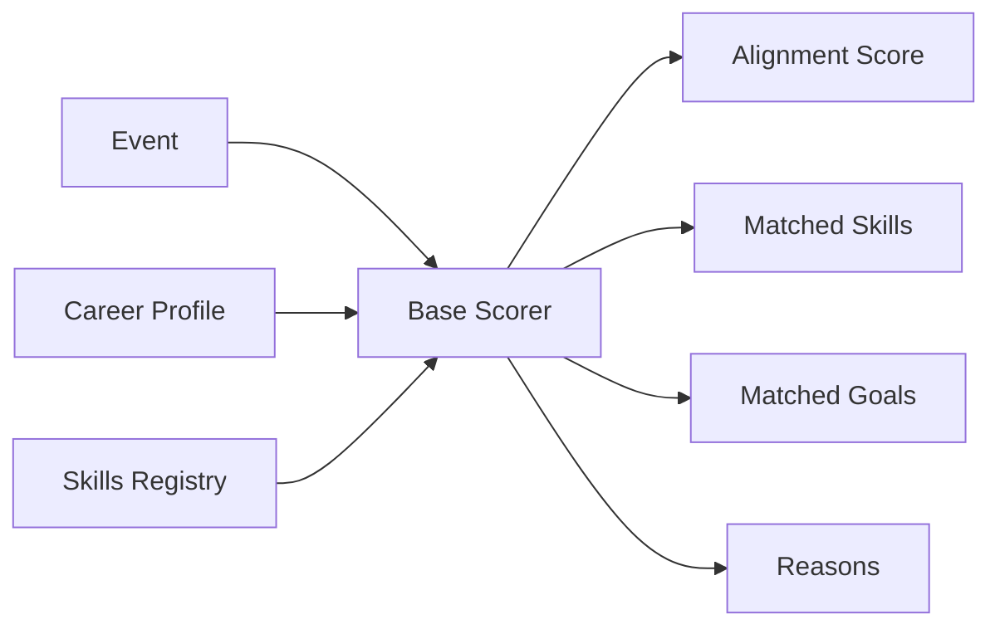

## Overview

The **base alignment core** is TechCal's foundational scoring algorithm that matches events to user career profiles. It's a pure, UI-independent function used consistently across server and client contexts.

<Info>
  **Location**: `src/lib/recommendation/baseScorer.ts:252-554`
  
  **Design Principle**: Single source of truth for base scoring logic (DRY principle)
</Info>

## Architecture



## Core Function

```typescript src/lib/recommendation/baseScorer.ts:252-259
export function calculateBaseScore(
  event: Event,
  careerProfile: CareerProfile | null
): BaseScorerResult {
  // Cold start: baseline scores when no profile exists
  if (!careerProfile) {
    return calculateColdStartScore(event);
  }
  // ... alignment calculation
}
```

## Scoring Components

The algorithm evaluates **7 alignment dimensions**:

### 1. Skills to Learn (Highest Priority)

**Weight**: 20 points per skill match, capped at 60 points

```typescript src/lib/recommendation/baseScorer.ts:414-429
careerProfile.skillsToLearn.forEach(skill => {
  if (skillMatches(skill)) {
    const contribution = ALIGNMENT_WEIGHTS.skillsToLearn; // 20
    rawTotal += contribution;
    matchedSkills.push(skill);
    reasons.push({ type: 'skill', reason: `Learn ${skill}`, contribution });
  }
});
const { cappedTotal } = collectAndCap(reasons, rawTotal, COMPONENT_CAPS.skillsToLearn);
alignmentScore += cappedTotal;
skillRelevance += cappedTotal;
```

**Purpose**: Prioritize learning opportunities for career growth.

**Example**:

- User wants to learn: `['React', 'TypeScript', 'GraphQL']`
- Event covers: React workshop with TypeScript
- **Score**: 40 points (2 skills × 20)

### 2. Primary Skills (Maintenance/Advancement)

**Weight**: 15 points per skill match, capped at 45 points

```typescript src/lib/recommendation/baseScorer.ts:432-446
careerProfile.primarySkills.forEach(skill => {
  if (skillMatches(skill)) {
    const contribution = ALIGNMENT_WEIGHTS.primarySkills; // 15
    rawTotal += contribution;
    matchedSkills.push(skill);
    reasons.push({ type: 'skill', reason: `Advance ${skill} skills`, contribution });
  }
});
```

**Purpose**: Help users maintain and advance existing expertise.

### 3. Career Goals

**Weight**: 18 points per goal match, capped at 36 points

```typescript src/lib/recommendation/baseScorer.ts:449-465
careerProfile.careerGoals.forEach(goal => {
  const keywords = GOAL_KEYWORDS[goal as keyof typeof GOAL_KEYWORDS] || [];
  const hasMatch = keywords.some(matchesKeyword);
  if (hasMatch) {
    const contribution = ALIGNMENT_WEIGHTS.careerGoals; // 18
    rawTotal += contribution;
    matchedGoals.push(goal);
    reasons.push({ type: 'goal', reason: getGoalReason(goal), contribution });
  }
});
```

**Goal Keywords** (from `src/config/scoringConfig.ts`):

```typescript
export const GOAL_KEYWORDS = {
  'skill-development': ['learn', 'training', 'workshop', 'bootcamp', 'course'],
  'career-advancement': ['promotion', 'leadership', 'management', 'senior'],
  'role-transition': ['career change', 'transition', 'switch', 'pivot'],
  'entrepreneurship': ['startup', 'founder', 'entrepreneur', 'venture'],
  'networking': ['networking', 'meetup', 'connect', 'community'],
  // ... more goals
};
```

### 4. Current Role Alignment

**Weight**: 10 points (flat)

```typescript src/lib/recommendation/baseScorer.ts:468-480
if (careerProfile.currentRole) {
  const roleKeywords = getRoleKeywords(careerProfile.currentRole);
  const hasMatch = roleKeywords.some(matchesKeyword);
  if (hasMatch) {
    const contribution = ALIGNMENT_WEIGHTS.role; // 10
    alignmentScore += contribution;
    careerStageMatch += contribution;
    alignmentReasons.push({
      type: 'role',
      reason: `Aligns with your ${careerProfile.currentRole} role`,
      contribution
    });
  }
}
```

**Role Keywords** (from `src/utils/roleTaxonomy.ts`):

- **Frontend Engineer**: `['frontend', 'react', 'vue', 'angular', 'ui', 'javascript']`
- **Backend Engineer**: `['backend', 'api', 'server', 'database', 'microservices']`
- **Data Scientist**: `['data science', 'machine learning', 'ml', 'ai', 'analytics']`

### 5. Interests

**Weight**: 12 points per interest match, capped at 30 points

```typescript src/lib/recommendation/baseScorer.ts:483-497
careerProfile.interests.forEach(interest => {
  if (matchesKeyword(interest)) {
    const contribution = ALIGNMENT_WEIGHTS.interests; // 12
    rawTotal += contribution;
    reasons.push({ type: 'interest', reason: `Matches interest: ${interest}`, contribution });
  }
});
const { cappedTotal } = collectAndCap(reasons, rawTotal, COMPONENT_CAPS.interests);
alignmentScore += cappedTotal;
industryRelevance += cappedTotal;
```

### 6. Learning Style

**Weight**: 8 points per style match, capped at 16 points

```typescript src/lib/recommendation/baseScorer.ts:500-516
careerProfile.learningStyle.forEach(style => {
  const keywords = LEARNING_STYLE_KEYWORDS[style] || [];
  const hasMatch = keywords.some(matchesKeyword);
  if (hasMatch) {
    const contribution = ALIGNMENT_WEIGHTS.learningStyle; // 8
    rawTotal += contribution;
    reasons.push({ type: 'learning-style', reason: getLearningStyleReason(style), contribution });
  }
});
```

**Learning Style Keywords**:

```typescript
export const LEARNING_STYLE_KEYWORDS = {
  'hands-on': ['workshop', 'lab', 'hands-on', 'practical', 'coding', 'tutorial'],
  'theoretical': ['lecture', 'talk', 'presentation', 'seminar', 'keynote'],
  'interactive': ['panel', 'discussion', 'q&a', 'interactive', 'fireside'],
  'networking': ['networking', 'social', 'meetup', 'mixer', 'happy hour'],
  'case-studies': ['case study', 'real-world', 'example', 'demo', 'showcase'],
  'peer-learning': ['peer', 'community', 'group', 'collaborative', 'pair']
};
```

### 7. Networking Goals

**Weight**: Up to 15 points based on keyword density

```typescript src/lib/recommendation/baseScorer.ts:518-536
if (careerProfile.networkingGoals.length > 0) {
  const networkingKeywords = GOAL_KEYWORDS.networking;
  const matchCount = networkingKeywords.filter(matchesKeyword).length;
  if (matchCount > 0) {
    // Scale: 5 points per keyword match, capped at 15
    const contribution = Math.min(
      matchCount * 5,
      ALIGNMENT_WEIGHTS.networking
    );
    alignmentScore += contribution;
    networkingValue += contribution;
    alignmentReasons.push({
      type: 'networking',
      reason: matchCount >= 3 ? 'High-value networking opportunity' : 'Community engagement opportunity',
      contribution
    });
  }
}
```

## Component Caps

To prevent score saturation and maintain top-end granularity:

```typescript src/lib/recommendation/baseScorer.ts:370-378
const COMPONENT_CAPS = {
  skillsToLearn: 60,   // max ~2-3 full matches
  primarySkills: 45,   // max ~3 full matches
  careerGoals: 36,     // max ~2 full matches
  interests: 30,       // max ~2-3 full matches
  learningStyle: 16,   // max ~2 full matches
  networking: 15,      // unchanged (already flat)
  role: 10,            // unchanged (already flat)
} as const;
```

**Capping Strategy**: Largest-remainder method

```typescript src/lib/recommendation/baseScorer.ts:381-412
const collectAndCap = (
  rawReasons: AlignmentReason[],
  rawTotal: number,
  cap: number
): { cappedTotal: number } => {
  const cappedTotal = Math.min(rawTotal, cap);
  if (rawTotal > cap && rawReasons.length > 0) {
    const scale = cap / rawTotal;
    // Floor each contribution
    const floored = rawReasons.map(r => Math.floor(r.contribution * scale));
    // Distribute remainder to entries with largest fractional parts
    const flooredSum = floored.reduce((s, v) => s + v, 0);
    let remainder = cappedTotal - flooredSum;
    const fractionals = rawReasons.map((r, i) => ({
      i,
      frac: (r.contribution * scale) - floored[i]
    }));
    fractionals.sort((a, b) => b.frac - a.frac);
    for (const { i } of fractionals) {
      if (remainder <= 0) break;
      floored[i] += 1;
      remainder -= 1;
    }
    rawReasons.forEach((r, i) => { r.contribution = floored[i]; });
  }
  alignmentReasons.push(...rawReasons);
  return { cappedTotal };
};
```

## Skill Matching

### Skill Registry

Canonical skill IDs for accurate matching:

```typescript src/lib/skills/skillRegistry.ts
export function resolveSkillIds(skills: string[]): string[] {
  return skills.map(skill => {
    const normalized = skill.toLowerCase().trim();
    // Check aliases
    if (SKILL_ALIASES[normalized]) {
      return SKILL_ALIASES[normalized];
    }
    // Check canonical registry
    if (SKILL_REGISTRY[normalized]) {
      return normalized;
    }
    return normalized; // Keep as-is if unknown
  });
}
```

**Aliases**:

```typescript
const SKILL_ALIASES = {
  'js': 'javascript',
  'ts': 'typescript',
  'react.js': 'react',
  'node': 'node.js',
  'k8s': 'kubernetes',
  // ... more aliases
};
```

### Whole-Word Matching

Prevents partial matches (e.g., "Java" won't match "JavaScript"):

```typescript src/lib/recommendation/baseScorer.ts:48-75
function matchesWholeWord(text: string, keyword: string): boolean {
  // Validate keyword to prevent ReDoS
  if (!validateKeyword(keyword)) {
    return false;
  }

  // Escape special regex characters
  const escapedKeyword = keyword.replace(/[.*+?^${}()|[\]\\]/g, '\\$&');
  
  // For keywords with non-word characters (e.g., "C++", "Node.js")
  const hasNonWordChars = /[^a-zA-Z0-9\s]/.test(keyword);
  
  if (hasNonWordChars) {
    const regex = new RegExp(`(?:^|\\s|\\b)${escapedKeyword}(?=\\s|\\b|$)`, 'i');
    return regex.test(text);
  }
  
  // Standard word boundary for regular keywords
  const regex = new RegExp(`\\b${escapedKeyword}\\b`, 'i');
  return regex.test(text);
}
```

## Cold Start Scoring

For anonymous users or users without profiles:

```typescript src/lib/recommendation/baseScorer.ts:116-239
function calculateColdStartScore(event: Event): BaseScorerResult {
  let score = 0;
  const alignmentReasons: AlignmentReason[] = [];
  
  // 1. Popularity score (0-15 points)
  const attendeeCount = event.attendeeCount || 0;
  if (attendeeCount > 1000) score += 15;
  else if (attendeeCount > 500) score += 12;
  else if (attendeeCount > 100) score += 8;
  
  // 2. Recency/Timing score (0-10 points)
  const daysUntilEvent = calculateDaysUntil(event.startTime);
  if (daysUntilEvent > 0 && daysUntilEvent <= 14) score += 10;
  else if (daysUntilEvent > 0 && daysUntilEvent <= 30) score += 7;
  
  // 3. Organizer reputation (0-8 points)
  const majorOrgs = ['google', 'microsoft', 'amazon', 'meta', 'apple'];
  if (majorOrgs.some(org => event.organization?.name.toLowerCase().includes(org))) {
    score += 8;
  }
  
  // 4. Event quality signals (0-7 points)
  const qualityKeywords = ['conference', 'summit', 'workshop', 'bootcamp'];
  if (qualityKeywords.some(kw => event.title.toLowerCase().includes(kw))) {
    score += 5;
  }
  
  // 5. Virtual events bonus (3 points)
  if (event.livestreamUrl || event.location?.toLowerCase().includes('virtual')) {
    score += 3;
  }
  
  // Normalize to 15-55 range
  const normalizedScore = Math.min(55, Math.max(15, score));
  
  return {
    overall: normalizedScore,
    components: { /* distributed proportionally */ },
    alignmentReasons,
    matchedSkills: [],
    matchedGoals: []
  };
}
```

<Note>
  Cold start scores are intentionally lower (15-55 range vs. 0-100) to encourage profile completion.
</Note>

## Result Structure

```typescript src/lib/recommendation/baseScorer.ts:94-107
export interface BaseScorerResult {
  overall: number; // 0-100
  components: {
    skillRelevance: number;
    careerStageMatch: number;
    networkingValue: number;
    industryRelevance: number;
    timingBonus: number;
  };
  alignmentReasons: AlignmentReason[];
  matchedSkills: string[];
  matchedGoals: string[];
}

export interface AlignmentReason {
  type: 'skill' | 'goal' | 'interest' | 'learning-style' | 'networking' | 'role';
  reason: string;
  contribution: number;
}
```

## Usage Examples

<CodeGroup>
```typescript Server-Side
// API route
import { calculateBaseScore } from '@/lib/recommendation/baseScorer';

export async function GET(request: NextRequest) {
  const profile = await getCareerProfile(userId);
  const events = await getUpcomingEvents();
  
  const scoredEvents = events.map(event => ({
    ...event,
    score: calculateBaseScore(event, profile)
  }));
  
  return NextResponse.json(scoredEvents);
}
```

```typescript Client-Side (via Adapter)
// Use UI adapter for client components
import { calculateUIScore } from '@/lib/recommendation/uiScoringAdapter';

function EventCard({ event, profile }) {
  const { overall, alignmentReasons } = calculateUIScore(event, profile);
  
  return (
    <div>
      <h3>{event.title}</h3>
      <ScoreBadge score={overall} />
      <ReasonsList reasons={alignmentReasons} />
    </div>
  );
}
```
</CodeGroup>

## Configuration

Weights are centralized in `src/config/scoringConfig.ts`:

```typescript
export const ALIGNMENT_WEIGHTS = {
  skillsToLearn: 20,    // Highest priority
  primarySkills: 15,    // Maintain expertise
  careerGoals: 18,      // Strategic alignment
  interests: 12,        // Personal relevance
  learningStyle: 8,     // Format preference
  networking: 15,       // Proportional (up to 15)
  role: 10,             // Context alignment
} as const;
```

<Accordion title="Why These Weights?">
  Weights are tuned based on user research and A/B testing:
  
  - **skillsToLearn** is highest because learning new skills is the primary driver for event discovery
  - **primarySkills** helps users maintain and advance current expertise
  - **careerGoals** ensures recommendations align with long-term objectives
  - **interests** adds personalization and serendipity
  - **learningStyle** respects format preferences (hands-on vs. lectures)
  - **networking** scales with keyword density (high-networking events get more points)
  - **role** provides baseline context
</Accordion>

## Performance

**Benchmarks** (run via `npm run bench:scoring`):

- **Single event**: < 5ms
- **100 events**: < 100ms
- **1000 events**: < 500ms (parallelizable)

**Optimizations**:

1. **Structured token index**: Pre-compute searchable tokens
2. **Skill ID resolution**: O(1) hash map lookups
3. **Regex caching**: Validated keywords cached
4. **Early exits**: Short-circuit when caps reached

## Testing

Parity tests ensure consistency:

```bash
npm run test:scoring
```

Validates:

- Score determinism (same inputs → same outputs)
- Cap enforcement (no component exceeds cap)
- Range constraints (0 ≤ score ≤ 100)
- Reason contribution sum matches overall score

## Next Steps

<CardGroup cols={2}>
  <Card title="Recommendation System" icon="sparkles" href="/architecture/recommendation-system">
    See how base scores are enhanced with advanced strategies
  </Card>
  <Card title="Ingestion Pipeline" icon="download" href="/architecture/ingestion-pipeline">
    Learn how event data is collected and prepared
  </Card>
</CardGroup>